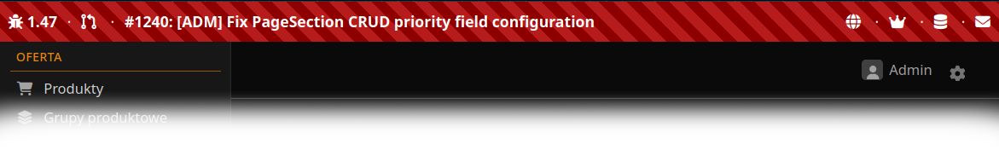

```ascii
▄▀▀▄             ▄▀█                    █▀▀▄  ▀                     █▀▀▄           █▀▀▄
▀▄▄       █▀█▀▄  █   ▄▀▀▄ █▀▀▄          █  █ ▀█  ▄▀▀▄ ▄▀▀▄ ▄▀▀▄     █  █ ▄▀▀▄ █  █ █▀▀▄ ▄▀▀▄ █▄▀
   █ █  █ █ █ █ ▀█▀  █  █ █  █ █  █     █  █  █   ▀▄  █    █  █     █  █ █▀▀  █  █ █  █  ▄▄█ █
▀▄▄▀ ▀▄▄█ █   █  █   ▀▄▄▀ █  █ ▀▄▄█     █▄▄▀ ▄█▄ ▀▄▄▀ ▀▄▄▀ ▀▄▄▀     █▄▄▀ ▀▄▄▀ ▀▄▀  █▄▄▀ ▀▄▄▀ █
     ▄▄▄▀                      ▄▄▄▀
 
                        Customizable developer toolbar for Symfony projects
```

# Welcome!

**DiscoDevBar** is a developer tool that adds a customizable toolbar/banner to your Symfony application,
providing all-time access to essential development resources right from your browser. Perfect for
streamlining your development workflow by keeping frequently-used tools, admin panels, and services
just one click away.

## What is DiscoDevBar?

DiscoDevBar creates a persistent banner (typically placed at the top of your layout) that displays
during development. It's highly configurable via YAML, allowing you to create custom buttons and
links to anything you need: admin panels, database tools, email catchers, API documentation, or
any other development resource.



### Perfect for Docker Environments

Since configuration is YAML-based, it's incredibly easy to generate dynamically when setting up new
development environments. When using Docker or similar containerization, port numbers often change
between setups - but with DiscoDevBar, you can regenerate the configuration file on each environment
startup, ensuring all links always point to the correct ports and services.

## Features

- **Fully customizable via YAML** - Easy to configure and regenerate for different environments
- **Flexible widget system** - Create buttons with Font Awesome icons, emoji, text labels, or any combination
- **Display anything** - Add links to admin panels, database tools, email catchers, API docs, or any development resource
- **Action buttons** - Direct access to frequently-used tools and services
- **Environment-aware** - Only loads in development environment, zero production overhead
- **Dynamic configuration** - Perfect for Docker setups where ports change - regenerate config on startup
- **Customizable placement** - Position widgets on left or right side of the toolbar

## Requirements

- PHP 8.1 or higher
- Symfony 6.4+ or 7.0+

## Installation

Install via Composer:

```bash
composer require marcinorlowski/symfony-discodevbar --dev
```

Register the bundle in `config/bundles.php`:

```php
return [
    // ... other bundles
    MarcinOrlowski\DiscoDevBar\DiscoDevBarBundle::class => ['dev' => true],
];
```

Install bundle assets:

```bash
php bin/console assets:install --symlink
```

## Configuration

Create a configuration file in your project root with widget configuration. The bundle will automatically
detect and load the first file found (in order of preference):

- `.disco-devbar.yaml` (recommended)
- `.disco-devbar.yml`

Example configuration that produces devbar shown in the screenshot above:

```yaml
widgets:
   left:
     - icon: "fa-bug"
       text: "1.47"
       url: "https://github.com/<FOO>/issues?q=is%3Aissue%20state%3Aopen%20milestone%3A1.47"
       target: "_blank"
       title: "Open Milestone 1.47 Issues"
     - icon: "fa-code-pull-request"
       url: "https://github.com/<FOO>/pulls"
       target: "_blank"
       title: "Open Repository Pull Requests"
     - text: "#1240: [ADM] Fix PageSection CRUD priority field configuration"
       url: "https://github.com/<FOO>>/issues/1240"
       target: "_blank"
       expand: true
   right:
     - icon: "fa-globe"
       url: "/"
       title: "Go to Main Page"
     - icon: "fa-crown"
       url: "/admin/"
       title: "Open Admin Panel"
     - icon: "fa-database"
       url: "http://localhost:21440"
       target: "_blank"
       title: "Open Database Manager"
     - icon: "fa-envelope"
       url: "http://localhost:21540"
       target: "_blank"
       title: "Open Mailpit"
```

### Widget Properties

| Property    |   Type   | Required | Description                                                                    |
|-------------|:--------:|:--------:|--------------------------------------------------------------------------------|
| `icon`*     | `string` |          | Optional icon to display. Can be Font Awesome class or emoji/text.            |
| `icon_type` | `string` |          | Icon type: `fa` (Font Awesome, default) or `text` (emoji/plain text).         |
| `text`*     | `string` |          | Optional widget label to display alongside icon.                              |
| `url`       | `string` |    *     | Link URL to redirect to once widget is clicked.                               |
| `target`    | `string` |          | Link target (e.g., `_blank`). Default: no target                              |
| `title`     | `string` |          | Tooltip text. If not given, `url` is shown.                                   |
| `expand`    |  `bool`  |          | Set to `true` to make widget expand and fill available space. Default `false`.|

*) Either `icon` or `text` must be provided or exception will be thrown.

### Font Awesome Icons

DiscoDevBar supports Font Awesome icons for widgets. You have two options for including Font Awesome:

#### Option 1: Automatic Inclusion (Recommended for Quick Setup)

Enable automatic Font Awesome inclusion from CDN in your `.disco-devbar.yaml` configuration file:

```yaml
font_awesome:
    enabled: true           # Enable auto-include from CDN (default: false)
    version: '6.5.1'        # Font Awesome version to use (optional, default: 6.5.1)

widgets:
    left:
        - icon: "fa-flag-checkered"
          text: "1.0"
          url: "https://github.com/user/repo"
```

**Benefits:**

- Works out of the box - no additional setup needed
- Icons display immediately
- Configuration kept in one place with your widgets

**Note:** Only enable this if your application doesn't already include Font Awesome. If you have Font Awesome in
your project, use Option 2 instead to avoid version conflicts.

#### Option 2: Manual Setup (Recommended if Font Awesome Already Installed)

If your application already includes Font Awesome (via NPM, CDN, or other means), simply use Font Awesome icon
classes in your widget configuration. DiscoDevBar will use your existing Font Awesome installation.

**Example:**

```yaml
widgets:
  left:
    - icon: "fa-database"
      icon_type: "fa"  # Use Font Awesome (default)
      url: "http://localhost:8080"
```

If you don't have Font Awesome installed, you can include it manually in your base template:

```twig
<link rel="stylesheet" href="https://cdnjs.cloudflare.com/ajax/libs/font-awesome/6.5.1/css/all.min.css" />
```

#### Using Text/Emoji Instead

If you prefer not to use Font Awesome, you can use emoji or plain text:

```yaml
widgets:
  left:
    - icon: "🚀"
      icon_type: "text"  # Use plain text/emoji
      url: "/admin"
```

## Usage

Include the devbar template in your base layout:

```twig

    

```

## Customization

### Custom CSS

The bundle includes default styling. To customize, override the CSS after importing bundle assets or
create your own styles targeting `.disco-devbar` classes.

### Custom Template

Override the default template by creating:
`templates/bundles/DiscoDevBarBundle/devbar.html.twig`

## License

- Written and copyrighted &copy;2025 by Marcin Orlowski <mail (#) marcinorlowski (.) com>
- DiscoDevBar is open-source software licensed under
  the [MIT license](http://opensource.org/licenses/MIT)
